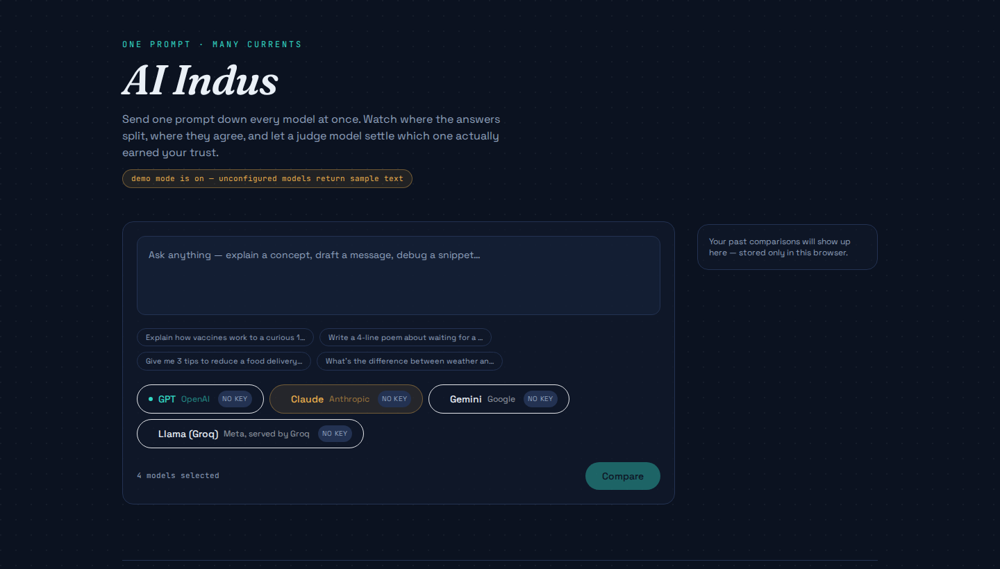
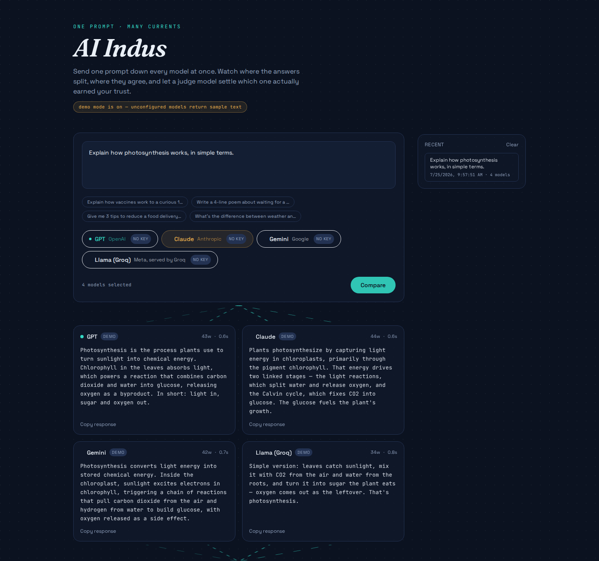
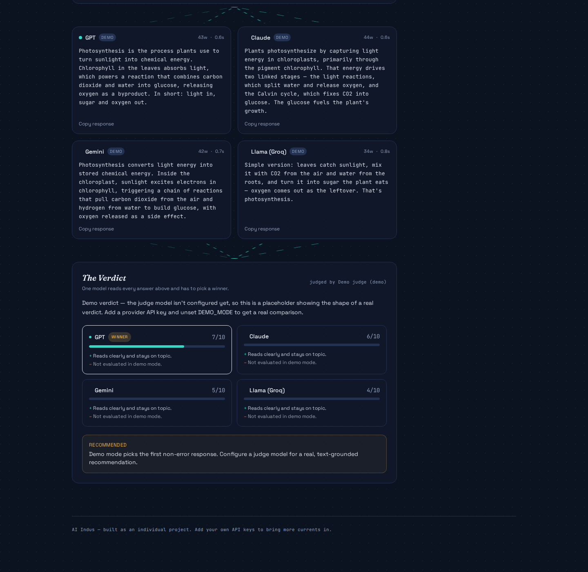

# AI Indus

**One prompt. Every model. One verdict.**

AI Indus lets you send a single prompt to several AI models at once — GPT, Claude, Gemini, and Llama (via Groq) — and see their answers side by side. Then, instead of you having to read four answers and guess which one is actually best, an **AI Judge** reads all of them itself and hands back a scored comparison and a single recommendation.

## a. What it does, and the problem it solves

Anyone who uses more than one AI assistant runs into the same friction: you're never sure which model will give you the best answer for *this specific* question, so you either commit to one and hope, or you manually copy-paste your prompt into four different tabs and eyeball the results. That's slow, and "eyeballing" isn't a real evaluation method.

AI Indus is built for that person — a student comparing explanations for revision, a developer sanity-checking a technical answer across models, or anyone who wants a second (and third, and fourth) opinion before trusting an AI's answer. It removes the tab-switching and adds an actual judgment step on top, so comparing models produces a decision, not just four walls of text.

It intentionally launches with a small, free-tier-friendly set of models. The architecture (see [Extending it](#extending-it)) is built so adding a fifth or a tenth model later is a two-line change, not a rewrite — exactly the "start small, go broader" scope this was designed around.

## b. Live URL

**[https://ai-indus-app.vercel.app](https://ai-indus-app.vercel.app/)**
NOTE: Gemini's free tier has a low request quoto; if it shows a quoto error, try again shortly or rely on the other configured models.

## c. Features

- **Multi-model compare** — send one prompt to any combination of GPT, Claude, Gemini, and Llama (Groq) in parallel, with per-model latency and word count shown.
- **AI Verdict (the AI feature)** — a judge model reads every response against the original prompt and returns a structured, scored comparison with one clear recommendation (see section d).
- **Model picker with live status** — each model chip shows whether its API key is configured on the server, so you always know what you're actually comparing.
- **Example prompts** — one-tap starter prompts for a fast first run.
- **Local history** — every comparison (prompt, results, and verdict) is saved to your browser's local storage so you can revisit or re-run it later, with a one-click clear.
- **Copy any response** — grab a single model's answer without retyping it.
- **Graceful degradation** — if a model's key isn't set, its card explains that clearly instead of failing silently; if *no* judge model is configured, the Verdict button explains why it's disabled instead of just not appearing.
- **Demo mode** (`DEMO_MODE=true`) — an optional flag for local development that returns clearly-labeled sample text for any unconfigured model, so the UI is fully explorable before you've added a single API key.
- Fully responsive, keyboard-accessible, dark-themed UI with reduced-motion support.

## d. The AI feature — the AI Verdict / Judge

This is the app's core AI-powered feature, beyond just relaying prompts to different APIs. After AI Indus collects every model's answer, it sends **all of them together** to one configured model (the "judge") along with a system prompt written specifically for this task, and asks it to actually evaluate them — not summarize them.

**What it does:**
1. Takes the original prompt + every model's raw response (including any that failed).
2. Sends it all to the judge model with the instructions below.
3. Parses the judge's structured JSON reply into a scored ranking (0–10 per model), a strength and a weakness for each, and one explicit, justified recommendation.
4. Renders it as a ranked comparison in the UI, with the winner highlighted.

**The system prompt** (verbatim, from [`lib/judgePrompt.ts`](./lib/judgePrompt.ts)):

```
You are the Judge inside AI Indus, an app that lets a user send one prompt to
several AI models and compare what comes back. You will be given the ORIGINAL
PROMPT the user sent, followed by the responses each model produced, each one
labeled with a model id.

Your job is to evaluate the responses AGAINST EACH OTHER and against the
original prompt, then return your verdict as a single recommendation the user
can actually act on. You are not summarizing the responses — you are judging
them.

Evaluate using these four criteria, in this order of importance:
1. Correctness — is the content factually and logically sound, given what you
   know? Penalize confident wrong answers more than hedged ones.
2. Relevance & completeness — does it actually answer what was asked, fully,
   without padding or missing the point?
3. Clarity — is it well organized and easy for a person to use as-is?
4. Efficiency — did it get there without unnecessary length or repetition?

Rules you must follow:
- Base every judgment on the actual text you were given. Never rely on a
  model's general reputation instead of what it actually wrote this time.
- If a response is missing, empty, or contains an error message, score it 0
  and say why in "weakness" — do not penalize the other responses for this.
- If two or more responses are genuinely tied, you may still only recommend
  ONE — break the tie using the criteria order above and say so.
- Keep every text field concise. No hedging like "it depends" — pick a winner.
- Scores are integers from 0 to 10.

Respond with ONLY a single valid JSON object — no markdown code fences, no
commentary before or after it, matching an exact schema with "summary",
"rankings" (id/score/strength/weakness per model), "recommended", and
"recommendedReason".
```

The full prompt (including the exact JSON schema) and the code that builds the per-comparison user message are in [`lib/judgePrompt.ts`](./lib/judgePrompt.ts); the parsing and API route are in [`app/api/verdict/route.ts`](./app/api/verdict/route.ts).

**Which model judges?** Whichever provider you've configured, in this priority order: Groq → Google → Anthropic → OpenAI (fast/cheap first), or force a specific one with `JUDGE_PROVIDER` in your environment.

## e. Tools, services, and models used to build it

- **Framework:** Next.js 14 (App Router) + TypeScript, Tailwind CSS
- **AI models integrated:** OpenAI (GPT), Anthropic (Claude), Google (Gemini), Groq (Llama) — called directly via their REST APIs, no SDK wrappers
- **Fonts:** Fraunces, Space Grotesk, JetBrains Mono (self-hosted via `@fontsource`)
- **Hosting:** Vercel
- **Built with the help of:** Claude (Anthropic) as an AI pair-programmer for scaffolding and code review
- **Version control:** Git / GitHub

## f. Screenshots

**Landing / prompt composer**


**Side-by-side model comparison**


**AI Verdict — the judge's scored recommendation**


_(Screenshots above were captured in `DEMO_MODE` for illustration — clearly labeled "demo" badges show where a real API key would produce live model output instead.)_

## g. How to run it

### Requirements
- Node.js 18.18+ 
- At least one API key from OpenAI, Anthropic, Google AI Studio, or Groq (Groq and Google both offer free tiers, good for testing)

### Local setup

```bash
git clone https://github.com/<your-username>/ai-indus.git
cd ai-indus
npm install
cp .env.example .env.local
# open .env.local and paste in at least one API key
npm run dev
```

Open [http://localhost:3000](http://localhost:3000). Any model without a key configured is clearly marked "no key" in the UI and returns an explanatory error instead of a fake answer — unless you set `DEMO_MODE=true` in `.env.local`, in which case unconfigured models return clearly-labeled sample text so you can explore the UI immediately.

### Deploying your own copy

1. Push this repo to your own **public** GitHub repository.
2. Go to [vercel.com](https://vercel.com) → **New Project** → import the repo.
3. In **Settings → Environment Variables**, add whichever keys you have (see `.env.example` for the full list — `OPENAI_API_KEY`, `ANTHROPIC_API_KEY`, `GOOGLE_API_KEY`, `GROQ_API_KEY`, and optionally `OPENAI_MODEL` / `ANTHROPIC_MODEL` / `GOOGLE_MODEL` / `GROQ_MODEL` / `JUDGE_PROVIDER` to override defaults). **Never commit these to the repo** — Vercel's environment variables are the only place they should live.
4. Deploy. Vercel gives you a live `https://your-project.vercel.app` URL automatically.
5. Update the live URL in section (b) of this README.

### Environment variables reference

| Variable | Required? | Purpose |
|---|---|---|
| `OPENAI_API_KEY` | one of the four required | enables the GPT card |
| `ANTHROPIC_API_KEY` | one of the four required | enables the Claude card |
| `GOOGLE_API_KEY` | one of the four required | enables the Gemini card |
| `GROQ_API_KEY` | one of the four required | enables the Llama (Groq) card |
| `*_MODEL` | optional | override the exact model id used per provider (defaults in `.env.example`) |
| `JUDGE_PROVIDER` | optional | force which configured provider acts as the AI Judge |
| `DEMO_MODE` | optional | `true` shows sample output for any unconfigured model, clearly labeled |

## Extending it

The model list lives entirely in [`lib/models.ts`](./lib/models.ts) and the UI reads it dynamically — adding model #5 (or #50) means adding one provider-call function in [`lib/providers.ts`](./lib/providers.ts) (if it's a new provider) and one entry in `MODELS`. Nothing else in the app needs to change.

## Project structure

```
app/
  page.tsx              main UI
  layout.tsx             fonts + metadata
  api/compare/route.ts   fans a prompt out to selected models in parallel
  api/verdict/route.ts   runs the AI Judge feature
  api/config/route.ts    tells the client which providers are configured
components/              ModelChip, ResultCard, VerdictPanel, HistoryPanel, Confluence
lib/
  models.ts              model registry
  providers.ts            per-provider API calls (OpenAI/Anthropic/Google/Groq)
  judgePrompt.ts          the AI Judge's system prompt
  demo.ts                 demo-mode sample responses
  types.ts                 shared types
```

## License

MIT — see [LICENSE](./LICENSE).
